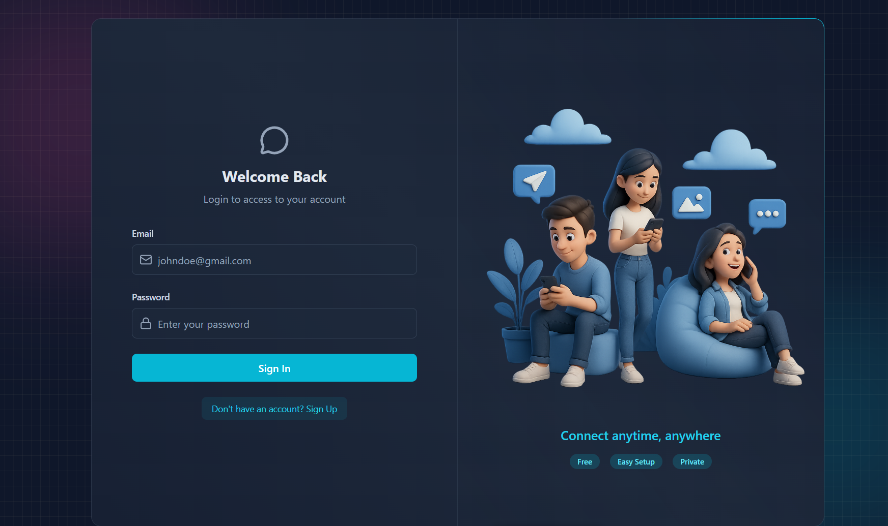

<div align="center">
  
  
  
</div>

<h1 align="center">Chatify - Real-Time Chat Application</h1>

<p align="center">
  A full-stack real-time chat application with authentication, messaging, and media sharing capabilities
</p>

<p align="center">
  
</p>

## 📋 Table of Contents

- [Overview](#overview)
- [Architecture](#architecture)
- [Features](#features)
- [Socket.IO Functionality](#socketio-functionality)
- [Tech Stack](#tech-stack)
- [Project Structure](#project-structure)
- [Getting Started](#getting-started)
- [API Documentation](#api-documentation)
- [Deployment](#deployment)
- [Contributing](#contributing)
- [License](#license)

## 📖 Overview

Chatify is a modern real-time chat application built with a React frontend and Node.js/Express backend. It features secure authentication, real-time messaging using Socket.IO, media sharing via Cloudinary, and email notifications through Resend.

### Key Benefits

| Benefit | Description |
|---------|-------------|
| 🔒 Security | JWT-based authentication with rate limiting via Arcjet |
| ⚡ Performance | Real-time messaging with Socket.IO |
| 📱 Responsive | Mobile-first design with Tailwind CSS |
| ☁️ Cloud Storage | Media handling with Cloudinary |
| 📧 Email Service | Transactional emails with Resend |

## 🏗️ Architecture

``mermaid
graph TB
    A[Client - React/Vite] --> B[API Gateway]
    B --> C[Auth Service]
    B --> D[Message Service]
    C --> E[(MongoDB)]
    D --> E
    D --> F[Socket.IO Server]
    F --> G[Real-time Clients]
    C --> H[Resend Email]
    D --> I[Cloudinary CDN]
    
    style A fill:#4FC08D
    style B fill:#42b883
    style C fill:#34495e
    style D fill:#34495e
    style E fill:#43b581
    style F fill:#8B4513
    style H fill:#5600E8
    style I fill:#00BEE0
```

### System Components

1. **Frontend** - React application with Vite bundler
2. **Backend** - Node.js/Express REST API with WebSocket support
3. **Database** - MongoDB with Mongoose ODM
4. **Authentication** - JWT tokens with cookie-based sessions
5. **Real-time** - Socket.IO for instant messaging
6. **Storage** - Cloudinary for media files
7. **Email** - Resend for transactional emails
8. **Security** - Arcjet for rate limiting and protection

### Microservice Architecture

```mermaid
graph LR
    A[Frontend] --- B[API Gateway]
    B --- C[Auth Service]
    B --- D[Message Service]
    C --- E[(User DB)]
    D --- F[(Message DB)]
    D --- G[Socket Service]
    C --- H[Email Service]
    D --- I[Media Service]
    
    style A fill:#4FC08D
    style B fill:#42b883
    style C fill:#34495e
    style D fill:#2c3e50
    style E fill:#43b581
    style F fill:#3498db
    style G fill:#8B4513
    style H fill:#9b59b6
    style I fill:#00BEE0
```



## ✨ Features

### Authentication
- ✅ Secure signup/login with password hashing
- ✅ JWT token authentication
- ✅ Session management with cookies
- ✅ Profile picture upload

### Messaging
- ✅ Real-time messaging with Socket.IO
- ✅ Message history
- ✅ Image sharing
- ✅ Online/offline user status

### UI/UX
- ✅ Responsive design for all devices
- ✅ Dark mode interface
- ✅ Animated UI components
- ✅ Loading skeletons
- ✅ Toast notifications

### Data Flow Diagram

```mermaid
flowchart LR
    A[User] --> B[Frontend UI]
    B --> C[API Request]
    C --> D[Backend Server]
    D --> E[Database]
    E --> D
    D --> F[Response]
    F --> B
    D --> G[Email Service]
    G --> H[Email Notification]
    H --> A
    D --> I[WebSocket]
    I --> J[Real-time Update]
    J --> A
    
    style A fill:#4FC08D
    style B fill:#42b883
    style C fill:#34495e
    style D fill:#2c3e50
    style E fill:#43b581
    style F fill:#3498db
    style G fill:#9b59b6
    style H fill:#e67e22
    style I fill:#8B4513
    style J fill:#e74c3c
```



### Authentication Flow

``mermaid
sequenceDiagram
    participant U as User
    participant F as Frontend
    participant B as Backend
    participant D as Database
    
    U->>F: Enter credentials
    F->>B: POST /api/auth/login
    B->>D: Validate user
    D-->>B: User data
    B->>B: Generate JWT
    B-->>F: JWT in cookie
    F->>F: Store user state
    F-->>U: Redirect to chat
```

### Messaging Flow

``mermaid
sequenceDiagram
    participant U1 as User 1
    participant U2 as User 2
    participant F1 as Frontend 1
    participant F2 as Frontend 2
    participant B as Backend
    participant S as Socket.IO
    participant D as Database
    
    U1->>F1: Type message
    F1->>B: POST /api/messages/send/{id}
    B->>D: Save message
    D-->>B: Confirmation
    B->>S: Emit message event
    S->>F2: Real-time message
    F2->>F2: Update UI
    F2-->>U2: Display message
```

## 🔌 Socket.IO Functionality

Chatify uses Socket.IO for real-time communication between clients and the server. This enables instant message delivery, online status updates, and other real-time features.

### Architecture

``mermaid
graph TD
    A[Frontend Client] --> B{Socket.IO Client}
    C[Frontend Client] --> D{Socket.IO Client}
    B --> E[Socket.IO Server]
    D --> E
    E --> F[Backend Logic]
    F --> G[(MongoDB)]
    E --> B
    E --> D
    
    style A fill:#61DAFB
    style B fill:#8B4513
    style C fill:#61DAFB
    style D fill:#8B4513
    style E fill:#42b883
    style F fill:#34495e
    style G fill:#43b581
```

### Key Features

| Feature | Description |
|---------|-------------|
| 💬 Real-time Messaging | Instant message delivery between users |
| 👤 Online Status | Real-time presence indicators |
| 🔔 Notifications | Instant alerts for new messages |
| 🔄 Bidirectional Communication | Server can push updates to clients |

### Implementation Details

#### Backend
- Socket.IO server is initialized in [socket.js](backend/src/lib/socket.js)
- Authentication middleware ensures only authenticated users can connect
- Online user tracking with `userSocketMap` to maintain user presence
- Event emission for new messages and online user updates

#### Frontend
- Socket.IO client connection established in [useAuthStore.js](frontend/src/store/useAuthStore.js)
- Real-time message subscription in [useChatStore.js](frontend/src/store/useChatStore.js)
- Online user status tracking
- Notification sounds for incoming messages

### Event Flow

``mermaid
sequenceDiagram
    participant C1 as Client 1
    participant S as Socket.IO Server
    participant C2 as Client 2
    participant DB as Database
    
    C1->>S: Connect with auth token
    S->>S: Validate authentication
    S-->>C1: Connection established
    S->>C2: Emit online users list
    
    C1->>S: Send message event
    S->>DB: Save message
    DB-->>S: Confirmation
    S->>C2: Emit new message
    C2->>C2: Display notification
```

## 🛠️ Tech Stack

### Frontend
| Technology | Purpose |
|------------|---------|
| React 19 | UI Library |
| Vite 7 | Build Tool |
| Tailwind CSS | Styling |
| Zustand | State Management |
| Socket.IO Client | Real-time Communication |
| Axios | HTTP Client |

### Backend
| Technology | Purpose |
|------------|---------|
| Node.js 20+ | Runtime Environment |
| Express | Web Framework |
| MongoDB | Database |
| Mongoose | ODM |
| Socket.IO | Real-time Communication |
| JWT | Authentication |
| Arcjet | Rate Limiting & Security |

### Services
| Service | Purpose |
|---------|---------|
| Cloudinary | Media Storage |
| Resend | Email Service |
| MongoDB Atlas | Database Hosting |

## 📁 Project Structure

```
.
├── backend/
│   ├── src/
│   │   ├── controllers/     → Request handlers
│   │   ├── emails/          → Email logic and templates
│   │   ├── lib/             → Utility and service clients
│   │   ├── middleware/      → Auth and protection layers
│   │   ├── models/          → MongoDB schemas
│   │   ├── routes/          → API route definitions
│   │   └── server.js        → Entry point
├── frontend/
│   ├── src/
│   │   ├── components/      → Reusable UI elements
│   │   ├── hooks/           → Custom React hooks
│   │   ├── lib/             → Configured clients
│   │   ├── pages/           → Route-level components
│   │   ├── store/           → State management
│   │   ├── App.jsx          → Root component
│   │   └── main.jsx         → Entry point
└── package.json            → Monorepo orchestration
```

## 🚀 Getting Started

### Prerequisites
- Node.js >= 20.0.0
- MongoDB instance (local or cloud)
- Cloudinary account
- Resend account

### Installation

1. Clone the repository:
```bash
git clone https://github.com/Mausam5055/chatify.git
cd chatify
```

2. Install dependencies:
```bash
npm run build
```

3. Set up environment variables (see backend/.env.example and frontend/.env.example)

4. Start the development servers:
```bash
# Terminal 1 - Backend
npm run start

# Terminal 2 - Frontend
npm run dev --prefix frontend
```

### Environment Variables

Refer to the individual README files in each directory for detailed environment variable setup.

## 📡 API Documentation

Detailed API documentation can be found in:
- [Backend API Documentation](backend/README.md#api-documentation)
- [Frontend Components](frontend/README.md#components)

## ☁️ Deployment

### Production Build
```bash
npm run build
```

### Deployment Options
1. Deploy backend to platforms like:
   - Render
   - Heroku
   - DigitalOcean App Platform
   - Sevalla

2. Deploy frontend to:
   - Netlify
   - Vercel
   - GitHub Pages
   - Sevalla

## 🤝 Contributing

1. Fork the repository
2. Create your feature branch (`git checkout -b feature/AmazingFeature`)
3. Commit your changes (`git commit -m 'Add some AmazingFeature'`)
4. Push to the branch (`git push origin feature/AmazingFeature`)
5. Open a pull request

## 📄 License

This project is licensed under the MIT License - see the [LICENSE](LICENSE) file for details.

---

<p align="center">
  Hosted on Sevalla | Made with ❤️ by <a href="https://github.com/Mausam5055">Mausam Kar</a>
</p>