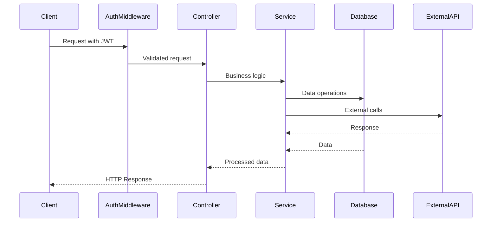
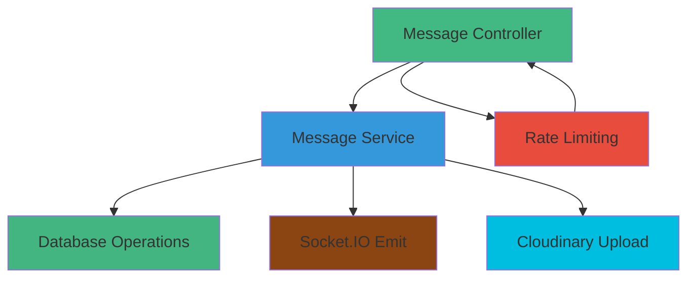
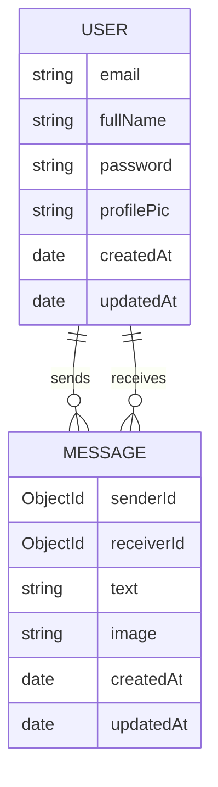

<div align="center">
  
  
  
  
</div>

<h1 align="center">Chatify Backend</h1>

<p align="center">
  RESTful API with real-time messaging capabilities for the Chatify application
</p>

## 📋 Table of Contents

- [Overview](#overview)
- [Architecture](#architecture)
- [API Endpoints](#api-endpoints)
- [Data Models](#data-models)
- [Middleware](#middleware)
- [Services](#services)
- [Installation](#installation)
- [Environment Variables](#environment-variables)
- [Development](#development)
- [Testing](#testing)
- [Deployment](#deployment)

## 📖 Overview

The backend is a Node.js/Express REST API that handles authentication, messaging, and real-time communication for Chatify. It uses MongoDB for data persistence and Socket.IO for real-time messaging.

### Core Responsibilities

| Responsibility | Description |
|----------------|-------------|
| 🔐 Authentication | User signup, login, session management |
| 💬 Messaging | Send/receive messages, message history |
| 👥 User Management | User profiles, contacts, online status |
| 🛡️ Security | Rate limiting, input validation, CORS |
| 📧 Notifications | Email verification, password reset |
| ☁️ Media Handling | Image uploads via Cloudinary |

## 🏗️ Architecture

```mermaid
graph TD
    A[Client Applications] --> B[Express Router]
    B --> C[Middleware Layer]
    C --> D[Controller Layer]
    D --> E[Service Layer]
    D --> F[Database Layer]
    E --> G[External Services]
    
    B --> H[Socket.IO]
    H --> I[Real-time Events]
    
    style A fill:#4FC08D
    style B fill:#42b883
    style C fill:#34495e
    style D fill:#2c3e50
    style E fill:#3498db
    style F fill:#43b581
    style G fill:#9b59b6
    style H fill:#8B4513
    style I fill:#e67e22
```



### Flow Diagram



### Authentication Flow

```mermaid
flowchart TD
    A[User Request] --> B[Auth Middleware]
    B --> C{Valid JWT?}
    C -->|No| D[401 Unauthorized]
    C -->|Yes| E[Attach User]
    E --> F[Controller]
    F --> G[Service]
    G --> H[Database]
    H --> G
    G --> F
    F --> I[Response]
    I --> A
    
    style A fill:#4FC08D
    style B fill:#34495e
    style C fill:#2c3e50
    style D fill:#e74c3c
    style E fill:#3498db
    style F fill:#42b883
    style G fill:#9b59b6
    style H fill:#43b581
    style I fill:#2ecc71
```




### Messaging Architecture



## 📍 API Endpoints

### Authentication Routes

| Method | Endpoint | Description | Middleware |
|--------|----------|-------------|------------|
| POST | `/api/auth/signup` | Register new user | Arcjet |
| POST | `/api/auth/login` | Authenticate user | Arcjet |
| POST | `/api/auth/logout` | End user session | Arcjet |
| PUT | `/api/auth/update-profile` | Update user profile | Arcjet, Auth |
| GET | `/api/auth/check` | Check authentication status | Auth |

### Messaging Routes

| Method | Endpoint | Description | Middleware |
|--------|----------|-------------|------------|
| GET | `/api/messages/contacts` | Get all contacts | Arcjet, Auth |
| GET | `/api/messages/chats` | Get chat partners | Arcjet, Auth |
| GET | `/api/messages/:id` | Get messages with user | Arcjet, Auth |
| POST | `/api/messages/send/:id` | Send message to user | Arcjet, Auth |

## 🗃️ Data Models

### User Model

```javascript
{
  email: String,          // Unique, required
  fullName: String,       // Required
  password: String,       // Required, min 6 chars
  profilePic: String,     // Default: ""
  timestamps: {           // Auto-generated
    createdAt: Date,
    updatedAt: Date
  }
}
```

### Message Model

```javascript
{
  senderId: ObjectId,     // Reference to User
  receiverId: ObjectId,   // Reference to User
  text: String,           // Max 2000 chars
  image: String,          // Optional image URL
  timestamps: {           // Auto-generated
    createdAt: Date,
    updatedAt: Date
  }
}
```

### Data Relationship Diagram




## ⚙️ Middleware

### Authentication Middleware
Located in [auth.middleware.js](src/middleware/auth.middleware.js):
- Verifies JWT tokens from cookies
- Attaches user object to request
- Handles unauthorized access

### Arcjet Middleware
Located in [arcjet.middleware.js](src/middleware/arcjet.middleware.js):
- Rate limiting for all API endpoints
- Protection against common attacks
- Shield rules enforcement

### Socket Authentication Middleware
Located in [socket.auth.middleware.js](src/middleware/socket.auth.middleware.js):
- Authenticates WebSocket connections
- Validates JWT for real-time communication

## 🔌 Services

### Database Service
Located in [db.js](src/lib/db.js):
- MongoDB connection management
- Connection status monitoring

### Email Service
Located in [resend.js](src/lib/resend.js):
- Resend API client configuration
- Email sending utilities

### Cloudinary Service
Located in [cloudinary.js](src/lib/cloudinary.js):
- Cloudinary API client configuration
- Image upload/delete utilities

### Socket.IO Service
Located in [socket.js](src/lib/socket.js):
- WebSocket server initialization
- Real-time event handling
- Connection management

### Environment Configuration
Located in [env.js](src/lib/env.js):
- Environment variable loading
- Validation and defaults

## 🚀 Installation

### Prerequisites
- Node.js >= 20.0.0
- MongoDB instance
- Cloudinary account
- Resend account

### Setup

1. Navigate to backend directory:
```bash
cd backend
```

2. Install dependencies:
```bash
npm install
```

3. Set up environment variables (see [.env.example](.env.example))

4. Start development server:
```bash
npm run dev
```

## 🔐 Environment Variables

Create a `.env` file in the backend root with these variables:

| Variable | Description | Required |
|----------|-------------|----------|
| `PORT` | Server port | Yes |
| `MONGO_URI` | MongoDB connection string | Yes |
| `JWT_SECRET` | Secret for JWT signing | Yes |
| `NODE_ENV` | Environment (development/production) | Yes |
| `CLIENT_URL` | Frontend URL for CORS | Yes |
| `CLOUDINARY_CLOUD_NAME` | Cloudinary cloud name | Yes |
| `CLOUDINARY_API_KEY` | Cloudinary API key | Yes |
| `CLOUDINARY_API_SECRET` | Cloudinary API secret | Yes |
| `RESEND_API_KEY` | Resend API key | Yes |

Example [.env.example](.env.example) file:
```env
PORT=3000
MONGO_URI=mongodb://localhost:27017/chatify
JWT_SECRET=your_super_secret_jwt_key_here
NODE_ENV=development
CLIENT_URL=http://localhost:5173
CLOUDINARY_CLOUD_NAME=your_cloud_name
CLOUDINARY_API_KEY=your_api_key
CLOUDINARY_API_SECRET=your_api_secret
RESEND_API_KEY=your_resend_api_key
```

## 💻 Development

### Scripts

| Script | Command | Description |
|--------|---------|-------------|
| Start Dev Server | `npm run dev` | Run with nodemon for auto-reload |
| Start Production | `npm start` | Run Node.js server |
| Lint | `npm run lint` | Check code quality |

### Folder Structure

```
src/
├── controllers/     → Request handlers
├── emails/          → Email logic and templates
├── lib/             → Utility and service clients
├── middleware/      → Auth and protection layers
├── models/          → MongoDB schemas
├── routes/          → API route definitions
└── server.js        → Entry point
```

## 🧪 Testing

### API Testing

Recommended tools:
- Postman
- Insomnia
- curl

### Test Endpoints

1. Authentication Flow:
   ```
   POST /api/auth/signup
   POST /api/auth/login
   GET /api/auth/check
   POST /api/auth/logout
   ```

2. Messaging Flow:
   ```
   GET /api/messages/contacts
   GET /api/messages/chats
   GET /api/messages/{userId}
   POST /api/messages/send/{userId}
   ```

## ☁️ Deployment

### Production Build

```bash
npm start
```

### Deployment Platforms

| Platform | Notes |
|----------|-------|
| Render | Easy Node.js deployment |
| Heroku | Free tier available |
| DigitalOcean App Platform | Good scalability |
| AWS Elastic Beanstalk | Enterprise option |

### Environment for Production

Ensure these environment variables are set in your production environment:
- `NODE_ENV=production`
- `MONGO_URI` (production database)
- All other required variables from [.env.example](.env.example)

### Health Checks

The server exposes a health check endpoint at the root path `/`.

---

<p align="center">
  Made with ❤️ by <a href="https://github.com/yourusername">Your Name</a>
</p>