<div align="center">
  
  
  
  
</div>

<h1 align="center">Chatify Frontend</h1>

<p align="center">
  Modern React-based UI for the Chatify real-time chat application
</p>

<p align="center">
  
</p>

## 📋 Table of Contents

- [Overview](#overview)
- [UI Architecture](#ui-architecture)
- [Components](#components)
- [State Management](#state-management)
- [Routing](#routing)
- [Styling](#styling)
- [Hooks](#hooks)
- [API Integration](#api-integration)
- [Installation](#installation)
- [Development](#development)
- [Building](#building)
- [Deployment](#deployment)

## 📖 Overview

The frontend is a React application built with Vite that provides a responsive, real-time chat interface. It features modern UI components, state management with Zustand, and real-time communication with Socket.IO.

### Key Features

| Feature | Description |
|---------|-------------|
| 💬 Real-time Chat | Instant messaging with Socket.IO |
| 🎨 Modern UI | Sleek dark theme with animations |
| 📱 Responsive Design | Works on mobile, tablet, and desktop |
| 🔐 Authentication | Secure login/signup flows |
| 🖼️ Media Sharing | Image upload and display |
| 📋 Contact Management | View contacts and chat history |

## 🏗️ UI Architecture



```mermaid
graph TD
    A[App.jsx] --> B[Router]
    B --> C[Pages]
    C --> D[Components]
    D --> E[Zustand Stores]
    D --> F[Custom Hooks]
    E --> G[API Layer]
    F --> G
    G --> H[Backend API]
    
    style A fill:#61DAFB
    style B fill:#42b883
    style C fill:#34495e
    style D fill:#2c3e50
    style E fill:#3498db
    style F fill:#9b59b6
    style G fill:#e67e22
    style H fill:#43b581
```

### Component Hierarchy

```mermaid
graph TD
    A[App.jsx] --> B[ChatPage]
    A --> C[LoginPage]
    A --> D[SignUpPage]
    
    B --> E[ProfileHeader]
    B --> F[ActiveTabSwitch]
    B --> G[ChatsList]
    B --> H[ContactList]
    B --> I[ChatContainer]
    
    I --> J[ChatHeader]
    I --> K[MessagesLoadingSkeleton]
    I --> L[NoConversationPlaceholder]
    I --> M[MessageInput]
    
    style A fill:#61DAFB
    style B fill:#42b883
    style C fill:#34495e
    style D fill:#2c3e50
    style E fill:#3498db
    style F fill:#9b59b6
    style G fill:#e67e22
    style H fill:#43b581
    style I fill:#8B4513
```



## 🧩 Components

### Layout Components

| Component | Location | Description |
|-----------|----------|-------------|
| [BorderAnimatedContainer](src/components/BorderAnimatedContainer.jsx) | [src/components/](src/components/) | Animated border container for main UI |
| [PageLoader](src/components/PageLoader.jsx) | [src/components/](src/components/) | Loading spinner for page transitions |

### Authentication Components

| Component | Location | Description |
|-----------|----------|-------------|
| [LoginPage](src/pages/LoginPage.jsx) | [src/pages/](src/pages/) | User login form |
| [SignUpPage](src/pages/SignUpPage.jsx) | [src/pages/](src/pages/) | User registration form |

### Chat Components

| Component | Location | Description |
|-----------|----------|-------------|
| [ChatPage](src/pages/ChatPage.jsx) | [src/pages/](src/pages/) | Main chat interface |
| [ProfileHeader](src/components/ProfileHeader.jsx) | [src/components/](src/components/) | User profile header with logout |
| [ActiveTabSwitch](src/components/ActiveTabSwitch.jsx) | [src/components/](src/components/) | Switch between chats and contacts |
| [ChatsList](src/components/ChatsList.jsx) | [src/components/](src/components/) | List of recent chat partners |
| [ContactList](src/components/ContactList.jsx) | [src/components/](src/components/) | List of all contacts |
| [ChatContainer](src/components/ChatContainer.jsx) | [src/components/](src/components/) | Individual chat window |
| [ChatHeader](src/components/ChatHeader.jsx) | [src/components/](src/components/) | Header for active chat |
| [MessageInput](src/components/MessageInput.jsx) | [src/components/](src/components/) | Input for sending messages |
| [NoConversationPlaceholder](src/components/NoConversationPlaceholder.jsx) | [src/components/](src/components/) | Placeholder when no chat selected |

### UI Helper Components

| Component | Location | Description |
|-----------|----------|-------------|
| [MessagesLoadingSkeleton](src/components/MessagesLoadingSkeleton.jsx) | [src/components/](src/components/) | Loading skeleton for messages |
| [UsersLoadingSkeleton](src/components/UsersLoadingSkeleton.jsx) | [src/components/](src/components/) | Loading skeleton for user lists |
| [NoChatHistoryPlaceholder](src/components/NoChatHistoryPlaceholder.jsx) | [src/components/](src/components/) | Placeholder for empty chat history |
| [NoChatsFound](src/components/NoChatsFound.jsx) | [src/components/](src/components/) | Placeholder when no chats found |

## 🗃️ State Management

We use Zustand for lightweight state management:

### Auth Store
Located in [useAuthStore.js](src/store/useAuthStore.js):
- User authentication state
- Login/signup functions
- Profile update functionality

### Chat Store
Located in [useChatStore.js](src/store/useChatStore.js):
- Selected chat partner
- Active tab state
- Messages for current conversation
- Real-time message updates

## 🔄 Routing

We use React Router for navigation:

| Path | Component | Protected | Description |
|------|-----------|-----------|-------------|
| `/` | ChatPage | Yes | Main chat interface |
| `/login` | LoginPage | No | User login |
| `/signup` | SignUpPage | No | User registration |

Protected routes redirect unauthenticated users to login.

## 🎨 Styling

### Tailwind CSS

We use Tailwind CSS for styling with custom configuration:

- Dark theme with slate color palette
- Gradient backgrounds and animated elements
- Responsive design utilities
- Custom component classes

### DaisyUI

DaisyUI components enhance the UI:
- Buttons with consistent styling
- Form elements
- Alerts and notifications

### Custom Animations

Located in [index.css](src/index.css):
- Animated background grid
- Glowing effect elements
- Smooth transitions

## 🪝 Hooks

### Custom Hooks

| Hook | Location | Description |
|------|----------|-------------|
| [useKeyboardSound](src/hooks/useKeyboardSound.js) | [src/hooks/](src/hooks/) | Plays sound on keypress for chat input |

### React Hooks

Standard React hooks used throughout:
- useState, useEffect, useRef
- useContext for global state
- useCallback for optimized functions

## 🌐 API Integration

### HTTP Client

Located in [axios.js](src/lib/axios.js):
- Base API configuration
- Request/response interceptors
- Error handling
- Base URL configuration

### API Endpoints Used

| Endpoint | Method | Description |
|----------|--------|-------------|
| `/api/auth/signup` | POST | User registration |
| `/api/auth/login` | POST | User authentication |
| `/api/auth/logout` | POST | End session |
| `/api/auth/check` | GET | Verify authentication |
| `/api/auth/update-profile` | PUT | Update user profile |
| `/api/messages/contacts` | GET | Fetch contact list |
| `/api/messages/chats` | GET | Fetch chat partners |
| `/api/messages/:id` | GET | Get messages with user |
| `/api/messages/send/:id` | POST | Send message |

### Real-time Communication

Socket.IO client connects to backend for:
- Instant message delivery
- Online/offline status updates
- Typing indicators (future feature)

## 🚀 Installation

### Prerequisites
- Node.js >= 20.0.0
- npm or yarn

### Setup

1. Navigate to frontend directory:
```bash
cd frontend
```

2. Install dependencies:
```bash
npm install
```

3. Set up environment variables (see [.env.example](.env.example))

4. Start development server:
```bash
npm run dev
```

## 💻 Development

### Scripts

| Script | Command | Description |
|--------|---------|-------------|
| Dev Server | `npm run dev` | Start development server |
| Build | `npm run build` | Create production build |
| Preview | `npm run preview` | Preview production build |
| Lint | `npm run lint` | Run ESLint |

### Folder Structure

```
src/
├── components/      → Reusable UI elements
├── hooks/           → Custom React hooks
├── lib/             → Configured clients
├── pages/           → Route-level components
├── store/           → State management
├── App.jsx          → Root component
└── main.jsx         → Entry point
```

### Development Workflow

1. Start the development server:
```bash
npm run dev
```

2. Make changes to components in [src/](src/)

3. See live updates in browser

4. Commit changes following conventional commits

## 🏗️ Building

### Production Build

```bash
npm run build
```

This creates a `dist/` folder with optimized assets.

### Build Output

| File | Size | Description |
|------|------|-------------|
| `index.html` | ~2KB | Main HTML file |
| `assets/` | ~500KB | JS/CSS bundles |
| `images/` | Variable | Static assets |

## ☁️ Deployment

### Deployment Platforms

| Platform | Notes |
|----------|-------|
| Vercel | Recommended for React apps |
| Netlify | Great static hosting |
| GitHub Pages | Free option |
| Firebase Hosting | Google solution |

### Deployment Steps

1. Create production build:
```bash
npm run build
```

2. Deploy the `dist/` folder to your chosen platform

### Environment Variables for Production

Ensure these are set in your deployment environment:
- `VITE_BACKEND_URL` - Backend API URL
- All other variables from [.env.example](.env.example)

### CI/CD Integration

Example GitHub Actions workflow:
```yaml
name: Deploy Frontend
on:
  push:
    branches: [main]
jobs:
  deploy:
    runs-on: ubuntu-latest
    steps:
      - uses: actions/checkout@v3
      - uses: actions/setup-node@v3
        with:
          node-version: 20
      - run: npm ci
      - run: npm run build
      - run: # Deploy dist/ folder to your platform
```

---

<p align="center">
  Made with ❤️ by <a href="https://github.com/yourusername">Your Name</a>
</p>